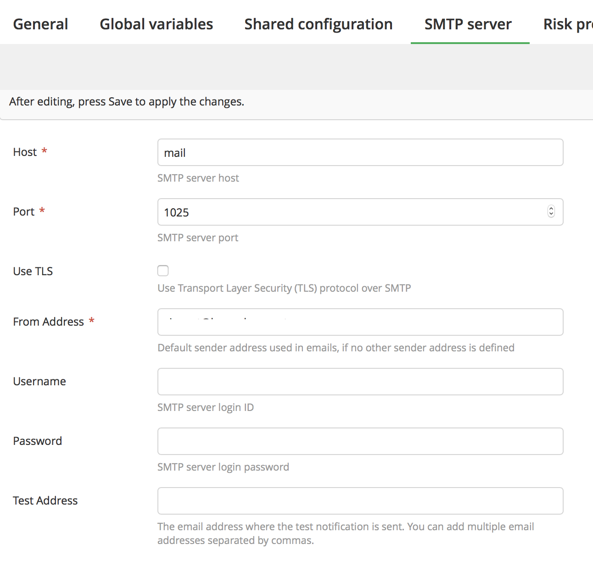

# eficode-root

# One time setup

1. Add `ADMIN_PASSWORD`, `XLD_LICENSE` and `XLR_LICENCE` (the licenses base64 encoded) variables in a `.env` file in the same folder as the `docker-compose.yml`, like so:
```
ADMIN_PASSWORD=

XLR_LICENSE=

XLD_LICENSE=
```
1. Add to the `secrets.xlvals` in the `docker/xlr/xebialabs` folder, adding the secret values obviously: 
```
# This file includes all secret values, and will be excluded from GIT. You can add new values and/or edit them and then refer to them using '!value' YAML tag

xldeploy_XLDeployServer_Ecommerce_password = 
xlrelease_Release_EcommerceAppReleaseProcess_scriptUserPassword = 
artifactory_Server_Ecommerce_password = 
git_Repository_Ecommerce_password = 

jira_username = 
jira_password = 

jenkins_Server_Ecommerce_password = 
bamboo_Server_Ecommerce_password = 
bitbucket_Server_Ecommerce_password = 
sonar_Server_Ecommerce_password = 
```

1. Add to the `secrets.xlvals` in the `docker/xld/xebialabs` folder, adding the secret values obviously:
```
BACKTRACE_ENDPOINT = https://submit.backtrace.io/testing-xebialabs2/alalala/json

BACKTRACE_TOKEN = lalala
```

1. Set up the XL Release server manually (no as code method)


1. Install Docker and do open up the TCP port [see here](https://redtalks.live/2017/05/26/redtalks-18-enabling-the-docker-tcp-api-in-aws/)

# Deploy beauty to Amazon (if you want to run on ec2)

1. `git clone this-repo`
1. Run `docker-compose build` the docker containers should be built

1. `docker-compose up -d` 
